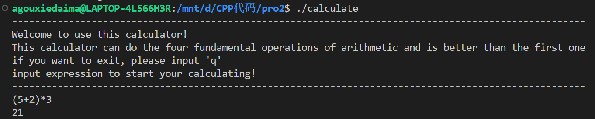

# CS205 C/ C++ Programming - Assignment1
Name: 高祖卿  
SID: 12112710
# Part 1-设计思路与分析
本次作业需要进一步完善上次作业的计算器，实现以下功能：
1.基本的数学表达式运算以及带括号的数学表达式运算
2.实现自定义变量运算(单字母变量)
3.支持任意精度的计算

下面将分点进行说明：
**1.对问题进行拆分**
不管是正常的数学表达式还是含自定义变量的表达式，根据递归的思想，最后都可以转化为两个数之间的四则运算，因此，我们需要先实现两个数之间的高精度计算，再将其推广到表达式的计算中，即可实现高精度的计算，在这里，我参考了网上一个较为完善的源码库，对其进行了一些修改，以实现两个数之间的高精度运算。
在本次提交的文件中为WTNumer.cpp和WTNumber.h。
>参考代码链接：https://blog.csdn.net/weixin_30401605/article/details/95726322
>该库实现的功能：
>1）支持任意精度的两个整数或小数的四则运算
>2）支持由const char*指针来创建对象

**2.对输入的处理**
本题的输入可以分为两种：数学表达式，含参数的表达式（自定义变量运算）。
为了区分两种表达式，我们先通过判断式子中是否含字母来进行简单区分。
```cpp
bool ifContainLetter(string expression)
{
    for (int i = 0; i < expression.length(); i++)
    {
        if ((expression[i] >= 65 && expression[i] <= 90) || (expression[i] >= 97 && expression[i] <= 122))
        {
            return true;
        }
    }
    return false;
}
```
1)数学表达式的处理
首先，我们需要对表达式做一个合法性判断，判断是否出现除数字、操作符或括号之外的非法字符，同时还需要判断左右括号是否匹配
```cpp
// check if the input is valid
bool checkValid(string expression)
{
        int openingParenthesis = 0;
        int closingParenthesis = 0;
        for (int i = 0; i < expression.length(); i++)
        {   //判断是否有非法字符
            if (!(expression[i] >= 40 && expression[i] <= 57 && expression[i] != 44))
            {
                return false;
            }
            if (expression[i] == 40)
            {
                openingParenthesis++;
            }
            if (expression[i] == 41)
            {
                closingParenthesis++;
            }
        }
        //判断左右括号是否匹配
        if (openingParenthesis != closingParenthesis)
        {
            return false;
        }
    
    return true;
}
```

一般的，我们把形如2+3*(4+5)+3/4这种标准四则运算表达式叫做中缀表达式，但是对于计算机来说，中缀表达式显得难以处理，为此，我们引进后缀表达式来降低处理的难度。
>参考方法来自csdn  
>链接1:https://www.cnblogs.com/whlook/p/7143327.html
>链接2:https://blog.csdn.net/sgbfblog/article/details/8001651

规则如下

为了防止负数的负号被误判成操作符，我们将输入的表达式中的负数的符号换成先导零。
```cpp
// Change the '-' for numbers less than zero to '0'
string pretreatment(string expression)
{
    /*遍历表达式，如果第一个运算数字为负数，或括号中的第一个数字为负数
      则将其负号换为先导零*/
    for (int i = 0; i < expression.length(); i++)
    {
        if (expression[i] == 45)
        {
            if (i == 0)
            {
                expression = expression.replace(0, 1, "0");
            }
            else if (expression[i - 1] == 40)
            {
                expression = expression.replace(i, 1, "0");
            }
        }
    }
    return expression;
}
```
之后我们对操作符的优先级进行规定
```cpp
// calculate the priority of the operator
int priorityCalculation(char o)
{
    if (o == '+' || o == '-')
    {
        return 1;
    }
    if (o == '*' || o == '/')
    {
        return 2;
    }
    return 0;
}
```
之后利用栈来实现中缀表达式到后缀表达式的转换
```cpp

// transform the expression to the Reverse Polish notation form
vector<string> transformToRPN(string expression)
{
    stack<char> op;
    vector<string> RPN;
    for (int i = 0; i < expression.length(); i++)
    {
        string s;
        if (expression[i] == '(')
        {
            op.push(expression[i]);
        }
        if (expression[i] == ')')
        {
            while (op.top() != '(')
            {
                s = op.top();
                RPN.push_back(s);
                op.pop();
                s = "";
            }
            op.pop();
        }
        if (expression[i] == '+' || expression[i] == '-' || expression[i] == '*' || expression[i] == '/')
        {
            if (op.empty() || op.top() == '(')
            {
                op.push(expression[i]);
            }
            else
            {
                while (!op.empty() && priorityCalculation(op.top()) >= priorityCalculation(expression[i]))
                {
                    s = op.top();
                    RPN.push_back(s);
                    op.pop();
                    s = "";
                }
                op.push(expression[i]);
            }
        }
        if ((expression[i] >= '0' && expression[i] <= '9'))
        {
            s += expression[i];
            while ((i + 1 < expression.size() && expression[i + 1] >= '0' && expression[i + 1] <= '9') || expression[i + 1] == '.')
            {
                s += expression[i + 1];
                i++;
            }
            RPN.push_back(s);
        }
    }
    while (!op.empty())
    {
        string s;
        s = op.top();
        RPN.push_back(s);
        op.pop();
        s = "";
    }
    return RPN;
}
```
得到后缀表达式之后，我们需要对后缀表达式进行计算来得到结果
>计算规则
首先建立一个栈 res 用来保存中间值，从左到右读取后缀表达式，遇到操作数直接入栈，遇到操作符则将栈顶的两个操作数弹出，完成计算后将计算结果压入栈


从规则中可知，我们成功将问题化解为两个两个数的逐步计算，最后得到高精度结果

```cpp
string calculate(vector<string> RPN)
{
    stack<string> res;
    for (int i = 0; i < RPN.size(); i++)
    {
        string s;
        s = RPN[i];
        if (s[0] >= 48 && s[0] <= 57)
        {
            res.push(s);
        }
        else if (s[0] == 43)
        {
            CWTNumber num1(res.top().c_str());
            res.pop();
            CWTNumber num2(res.top().c_str());
            res.pop();
            string resultOfAdd = (num1 + num2).ToString();
            res.push(resultOfAdd);
        }
        else if (s[0] == 45)
        {
            CWTNumber num1(res.top().c_str());
            res.pop();
            CWTNumber num2(res.top().c_str());
            res.pop();
            string resultOfMinus = (num2 - num1).ToString();
            res.push(resultOfMinus);
        }
        else if (s[0] == 42)
        {
            CWTNumber num1(res.top().c_str());
            res.pop();
            CWTNumber num2(res.top().c_str());
            res.pop();
            string resultOfTime = (num1 * num2).ToString();
            res.push(resultOfTime);
        }
        else if (s[0] == 47)
        {
            CWTNumber num1(res.top().c_str());
            res.pop();
            CWTNumber num2(res.top().c_str());
            res.pop();
            string resultOfDivide = (num2 / num1).ToString();
            res.push(resultOfDivide);
        }
    }
    return res.top();
}
```
至此，我们已经完成了对普通的数学表达式的四则运算

2)含参数的表达式的处理
让我们看一个示例
>a=3
b=5
a+b-1

为了计算含参数的数学表达式，我们初步的想法是将参数替换为值，即将a+b-3转换为3+5-1。之后就可以按照1)中正常的数学表达式进行处理。
首先，我们需要对给参数赋值的式子进行合法性检验,以防止出现多字母变量或是其他非法字符
```cpp
bool checkValid(string expression)
{
    if ((expression[0] >= 65 && expression[0] <= 90) || (expression[0] >= 97 && expression[0] <= 122))
    {
        if (expression[1] != '=')
        {
            return false;
        }

        if (!((expression[2] >= 48 && expression[2] <= 57) || expression[2] == 43 || expression[2] == 45))
        {
            return false;
        }

        for (int i = 3; i < expression.length(); i++)
        {
            if (!(expression[i] >= 48 && expression[i] <= 57))
            {
                return false;
            }
        }
        return true;
    }
    return true;
}
```
检查完合法性后，本程序支持对多个变量进行赋值（最多26+26个），我们用两个vector分别储存变量名和对应的值，以便之后的替换
```cpp
    vector<string> letter;
    vector<string> num;
    if (ifContainLetter(expression))
        {
            if (!ifCalculate(expression))
            {
                if (!checkValid(expression))
                {
                    puts("The input is not valid,please check your input!");
                }
                else
                {
                    string tem1;
                    string tem2(1, expression[0]);
                    for (int i = 2; i < expression.length(); i++)
                    {
                        tem1 += expression[i];
                    }
                    letter.push_back(tem2);
                    num.push_back(tem1);
                }
            }
```
赋值结束后，我们还需要判断含参数的数学表达式是否出现。我们用表达式中是否有操作符来简单判断。
```cpp
bool ifCalculate(string expression)
{
    for (int i = 0; i < expression.length(); i++)
    {
        if (expression[i] == 42 || expression[i] == 43 || expression[i] == 45 || expression[i] == 47)
        {
            return true;
        }
    }
    return false;
}
```
含参数的表达式出现后，我们对其进行替换操作，然后按照正常的数学表达式对其进行计算，得到结果。
```cpp
else
            {
                for (int i = 0; i < num.size(); i++)
                {
                    expression = expression.replace(expression.find(letter[i]), num[i].size(), num[i]);
                }
                letter.clear();
                num.clear();
                expression = pretreatment(expression);
                vector<string> RPN1 = transformToRPN(expression);
                cout << calculate(RPN1) << endl;
            }
```
至此，我们完成了三个功能的实现。
# Part 2-代码
github链接
https://github.com/Agouiscoding/cpp-pro2

# Part 3-测试结果
1.使用CMake管理文件


2.不含括号的表达式


3.含括号的表达式


4.自定义变量的表达式


5.任意精度的计算


6.多个变量的赋值计算


7.一些高精度计算
